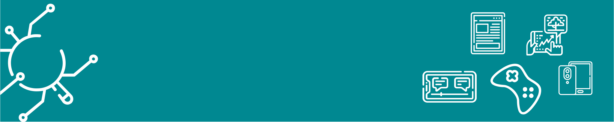

# **O Uso do Aplicativo QR Code como Recurso Pedagógico no Ensino da Língua Portuguesa**

??? "Ferramentas de acessibilidade"

    :material-cursor-default-click-outline: Clique no botão abaixo para alternar visualização:

    

       <button data-md-color-scheme="default"><code>Modo normal</code></button>
       <button data-md-color-scheme="slate"><code>Modo escuro</code></button>
    

    

??? info "Autores"
    === "Eriskarine Barbosa do Nascimento"

        Especialista em Tecnologias e Educação Aberta e Digital (UFRB - UAb Portugal). Especialista em Literatura Brasileira (UNEB). Graduada em Comunicação Social (UNEB). E-mail: assessoria.jkr@gmail.com.

    === "Luciana Oliveira Lago"

        Mestra em Educação de Jovens e Adultos (UNEB). Licenciada em Letras Vernáculas (UNEB). Integrante do Grupo de Pesquisa GEPLET - UNEB/UEFS. Tem experiência em ensino de Língua Portuguesa, Redação, Filosofia e TIC. Atuou por três anos consecutivos como corretora das redações do ENEM. Atuou no Ensino Superior ministrando as disciplinas de EJA, TIC na Educação e Pesquisa em Educação. Foi professora da disciplina Orientação de TCC na UFRB. Tem experiência com uso de plataformas digitais de aprendizado, é autora dos sites auxilix.com e o cogito, logo digito. Ocupação atual. Professora. E-mail: lulago77@hotmail.com.

**Resumo**: O uso das tecnologias no processo pedagógico é um tema em
constante discussão no novo panorama educacional, uma vez que há a
presença dessas ferramentas em todos os ambientes da sociedade. Nesse
contexto, a educação está se adaptando a esse cenário e implantando
recursos nas práticas diárias, a fim de possibilitar um ensino que
esteja em consonância com os interesses da sociedade. Dessa forma, este
artigo pretende discutir como a utilização das Tecnologias Digitais da
Informação e Comunicação (TDIC) contribui com o ensino-aprendizagem da
Língua Portuguesa. Além disso, o artigo tem como objetivo refletir
acerca das novas interfaces de ensino e aprendizagem. Para
exemplificarmos tal fato, apresentamos uma pesquisa de cunho
bibliográfico, que descreve o percurso histórico do aplicativo e sua
funcionalidade. Ademais, a metodologia é uma revisão integrativa de
literatura, embasados em autores como Vieira e Coutinho (2013); Carvalho
(2015); Mion (2015); Rodrigue *et al* (2017); Santomé (2013); Seqret
(2017) e Lemos (1999).

**Palavras-chave:** QR *Code;* Recurso Pedagógico; Língua Portuguesa.

## Introdução 

De acordo com o Dicionário Houaiss, escrever é traçar, fazer letras,
marcar, assinalar, gravar, desenhar e representar em caracteres. Adoto
esse conceito para falar de maneira ampla, o que cada um escreve para
si. Nenhuma escrita é igual, cada um guarda o seu singular. No dizer de
Clarice Lispector (1999, p. 102), "escrever é prolongar o tempo, é
dividi-lo em partículas de segundos, dando a cada uma delas uma vida
insubstituível".

Assim, este artigo pretende discutir como a utilização das Tecnologias
Digitais da Informação e Comunicação (TDIC) contribui com o
ensino-aprendizagem da Língua Portuguesa, uma vez que a nova geração de
crianças e de jovens deseja interagir, compartilhar, sentir-se
desafiada, usar e incorporar as TDIC diariamente, para navegar,
encontrar informação e compartilhá-la.

As TDIC compreende um conjunto de equipamentos e aplicações tecnológicas
que geralmente utilizam a internet, como o aplicativo Quick Response
Code (*QR Code*), um código de barras, criado em 1994, possui esse nome
porque dá a capacidade de ser interpretado rapidamente pelas pessoas. A
leitura desse código é feita com um aplicativo que pode ser facilmente
instalado nos aparelhos que possuem câmera fotográfica.

Dessa forma, é possível afirmar que, hodiernamente, vivemos em uma era
digital, a qual perpassa por uma grande transformação, haja vista os
avanços tecnológicos. Sendo assim, torna-se cada vez mais inevitável
ignorar o uso de tecnologias no cotidiano, devido a intensificação do
acesso à comunicação e aos meios de informação.

Nessa perspectiva, o presente artigo tem como objetivo investigar o uso
do *QR Code* como ferramenta pedagógica e sua contribuição no processo
de ensino e aprendizagem, estabelecendo um processo educacional que
acompanha o desenvolvimento tecnológico da humanidade. Para
exemplificarmos tal fato, apresentamos uma pesquisa de cunho
bibliográfico, que descreve o percurso histórico do aplicativo e sua
funcionalidade. Ademais, a metodologia é uma revisão integrativa de
literatura.

Para tanto, será utilizado como referencial bibliográfico as publicações
de Vieira e Coutinho (2013); Carvalho (2015); Mion (2015); Rodrigue *et
al* (2017); Santomé (2013); Seqret (2017) e Lemos (1999).

## O uso do Aplicativo Qr Code no Processo Educativo 

A utilização das tecnologias no processo pedagógico é um tema em
constante discussão no novo panorama educacional, uma vez que há a
presença das tecnologias em todos os ambientes da sociedade. Nesse
contexto, a educação está adaptando a esse cenário e implantando os
recursos nas práticas diárias a fim de possibilitar um ensino que esteja
em consonância com os interesses da sociedade. Segundo o Ministério de
Educação, nas Diretrizes Curriculares Nacionais para o Ensino
Fundamental de nove anos (BRASIL, 2010), faz-se necessário a inserção da
tecnologia no currículo deste nível de ensino, conforme o Artigo 28º,
das Diretrizes Curriculares Nacionais da Educação Básica (2012, p. 136).

> \[...\] A utilização qualificada das tecnologias e conteúdos das mídias
como recurso aliado ao desenvolvimento do currículo, contribui para o
importante papel que tem a escola como ambiente de inclusão digital e de
utilização crítica das tecnologias da informação e comunicação \[\...\].

Sendo assim, o desenvolvimento tecnológico instiga novos percursos e
desafios ao modo de ensinar e aprender. Neste trabalho, é possível
perceber que o uso do aplicativo QR Code (Figura
1) em atividades desenvolvidas na disciplina
de Língua Portuguesa no sétimo ano do Centro de Educação Probo Meira
Júnior (Probo Coc) possibilitou aos estudantes uma maneira inovadora de
aprender os conteúdos.

Figura 1: QR
Code.

 <small>
Fonte: Coleção Infinito Digital, 2019.
</small>

Dessa forma, a inserção do aplicativo, associado ao conteúdo do módulo,
transformou-se em um recurso pedagógico atual e atraente, o qual permite
explorar novas oportunidades de aprendizagem mais flexíveis, motivadoras
e capazes de estimular a autoria e a autonomia dos alunos. Tal fato já é
perceptível no comportamento dos alunos, uma vez que eles e professores
têm a sua disposição vídeos, infográficos, jogos e animações que visam
de maneira interativa e divertida, aprofundar ainda mais seus
conhecimentos no assunto estudado.

Sendo assim, uso dos *QR Code*, dispostos nos módulos da "Coleção
Infinito" favorecem a aprendizagem interdisciplinar, por meio de
conteúdos didáticos impressos e digitais, os quais possibilitam o
desenvolvimento das inteligências múltiplas, pois a abordagem híbrida,
também conhecido como b-learning Bacich diversifica a aprendizagem. Neto
e Mello (2015, pág. 15), definem o ensino híbrido como sendo:

> \[...\] uma abordagem pedagógica que combina atividades presenciais e
atividades realizadas por meio das tecnologias digitais da informação e
comunicação (TDICs). Existem diferentes propostas de como combinar essas
atividades, porém, na essência, a estratégia consiste em colocar o foco
do processo de aprendizagem no aluno e não mais na transmissão de
informação que o professor tradicionalmente realiza.

Assim, através desta proposta, pretende-se mostrar que o uso das
inovações tecnologias e pedagógicas como o *QR Code* associado ao módulo
(físico) potencializa a aprendizagem dos alunos e desenvolve
inteligências múltiplas (FIGURA
2), uma vez que ao colocar o aluno no centro
do processo, ele se torna mais autônomo, confiante, responsável e
criativo.

Figura 2: Tipos de
Inteligência.

 <small>
Fonte: Coleção Infinito Digital, 2019.
</small>

Nesse sentido, o ponto de partida do presente trabalho deve-se à mudança
do material didático, que apresenta os QR *Code* como complemento dos
conteúdos, aliado ao fato de que todos os estudantes dessa escola
possuem aparelhos celulares e, se os estudantes gostam tanto dos
dispositivos móveis, por que não inseri-los para a construção do
conhecimento? CARVALHO (2015, p. 12) assevera que

> \[...\] Motivar os alunos para aprender constitui um desafio. Se
apresentar um QR *Code*, os alunos têm que usar o dispositivo móvel,
precisando ter um leitor compatível, para descodificar a mensagem que
surge num código de barras 2D. É uma forma de mostrar e esconder.
Sabe-se que nos leva a algo, mas à vista desarmada não se sabe aonde.
Por outro lado, com esse código que ocupa pouco se pode dizer muito!
\[\...\].

Convém lembrar ainda que, nos últimos anos, a sociedade está imersa por
informações, uma vez que a evolução das TDIC nos permite experimentar
novas possibilidades, tornando-nos seres cada vez mais conectados.
Assim, neste espaço interativo, os indivíduos, desde muito cedo, são
postos em contato com o computador, *tablet*, celular e de diversos
*softwares* e aplicativos, modificando os costumes e hábitos desse
grupo. Esse desenvolvimento da tecnologia impulsionou uma evolução
cultural tornando os indivíduos cotidianamente conectados.

Sendo assim, os estudantes que frequentam as escolas, na
contemporaneidade, formam uma geração cujos sujeitos são chamados de
"nativos digitais", isto é, que já nasceram na era tecnológica, enquanto
os adultos são "imigrantes", não nasceram no mundo digital e adotaram a
tecnologia em algum momento da sua vida (PRENSKY, 2001).

Não obstante, vivemos em uma sociedade do conhecimento, o acesso a esse
conhecimento culturalmente gerado não é fácil, como mostram as crises
permanentes vividas por nossos sistemas educacionais (POZO, 2007). Nesse
sentido, o papel do professor, neste cenário educacional, é
constantemente questionado, pois a tecnologia faz parte do cotidiano das
crianças e adolescentes. Ademais, o modelo de aula com o uso da
tecnologia torna-se mais dinâmica.

Logo, faz-se necessário atualizar as interfaces educativas, tornando-as
mais significativa com os impactos sociodigitais, adaptando as
instituições de ensino para essas mudanças, infraestrutura e material
didático devem prever a inserção e utilização da tecnologia como aliada
e facilitadora desse processo. Dessa forma, o uso de interfaces
tecnológicas nos ambientes escolares exerce um papel essencial nesta
modernização e contribuem com o processo do ensino aprendizagem da
geração "Z".

Segundo Borges e Silva *apud* Guzzo e Hoshino (2001), a chamada Geração
Z, assim foi denominada por zapear de uma coisa para outra, olham
televisão, ficam no telefone, no computador entre outras coisas,
simultaneamente. Esta geração interage normalmente com vários
equipamentos eletrônicos ao mesmo tempo e não imaginam o planeta sem a
tecnologia. Nasceram na era digital e se sentem à vontade, (zapeando)
com seus apetrechos eletrônicos. Para eles não existem fronteiras, os
amigos virtuais estão espalhados pelo mundo, através das redes sociais.

Para Lima (2012), "\[...\] a Geração Z é formada por crianças e
adolescentes de dois a 14 anos de idade, que já nasceram conectadas e
não vê o mundo sem a existência da internet, dos computadores, chats,
telefones celulares, videogames, no qual interagem simultaneamente sem
problemas".

A Geração Z tem um conceito de mundo sem limites geográficos, esta
geração tem muita facilidade e domínio das tecnologias e senso de
urgência em conhecer e se conectar a todas as possibilidades de
intercâmbio virtual. Com toda esta interação tecnológica a Geração Z
passa boa parte do tempo em seu mundo particular. Esse comportamento,
destarte, causa carência dos benefícios decorrentes das relações
interpessoais.

Para Borges e Silva (2013, p. 04), por nascer neste cenário atual e
amplamente conectado essa geração traz consigo um conceito de mundo sem
nenhum limite temporal o geográfico, além disso:

> \[...\] tem muita facilidade e domínio das novas tecnologias e senso de
urgência em conhecer e se conectar a todas as possibilidades de
intercâmbio virtual. Com toda esta interação tecnológica a Geração Z
passa boa parte do tempo encerrada em seu mundo particular, muitas vezes
sem conversar com ninguém, nem mesmo com os pais, o que causa carência
dos benefícios decorrentes das relações interpessoais \[...\].

Assim, a inserção da tecnologia digital acresce o espaço escolar
aderindo novas fontes de pesquisa e conhecimento, preparando os jovens
para os desafios atuais como os futuros. A educação mediada pelas TDIC
não deve se restringir apenas para que esta se torne tecnologicamente
correta ou ao manuseio de equipamentos e reprodução do que já está
feito. Sua inserção em sala de aula deve ser acompanhada por uma
metodologia apropriada às necessidades dos alunos, criando conexões com
o seu cotidiano e contexto cultural sendo utilizada de forma adequada e
significativa, instigando os estudantes à autoria, ao aprender a
aprender.

Conforme Demo (2008, p.3), "\[...\] o que transforma tecnologia em
aprendizagem, não é a máquina, o programa eletrônico, o *software*, mas
o professor, em especial em sua condição socrática". O professor que
toma conhecimento das novas tecnologias pode se apoderar disso para
buscar melhorias para o seu trabalho (MION, 2015).

A acessibilidade às mídias tem ofertado uma gama de material
diversificado aos quais os jovens, às vezes, nem sabem o que fazer com
tantas informações e muitas vezes perdem o foco. Dessa forma, a inserção
correta das tecnologias no ambiente escolar incentiva o processo
didático-pedagógico e integra novas e significativas aprendizagens.

De acordo com Ausubel (2003), os seres humanos tem a tendência de
trabalhar mais e sentem-se muito mais motivados quando as atividades de
aprendizagem que iniciam fazem sentido. Assim, o conhecimento apreendido
é mais facilmente internalizado, produzindo novas aprendizagens e o
avanço dos indicadores de desempenho no sistema educacional.

### Código de Resposta Rápida/emphQR Code 

No que se refere ao *QR Code* esse código pode ser lido por quase todos
os celulares que possuem câmeras fotográficas; a leitura do código é
realizada por meio da correção de erros Reed-Solomon, até que a imagem
seja interpretada.

Consoante Jefferson Carlos (2017), o padrão japonês para o Código QR foi
lançado em janeiro de 1999 e obedece ao padrão internacional ISO/IEC
18004, aprovado em junho de 2000. Conforme essa norma o Código QR pode
ser definido como uma tecnologia livre.

Dessa forma, ela permite que qualquer pessoa possa gerar um código a
partir do endereço de um site, telefone, *Short Message Service*
(Serviço de Mensagens Curtas - SMS); *Portable Document Format* (Formato
Portátil de Documento - PDF) ou texto, por meio de diversas ferramentas
disponíveis na internet como o gerador de QR Code da Shopify e o QR Code
Generator ou ainda, aplicativos geradores de QR Codes no Android e iOS
como o TapMedia QR Reader e o QR Code Generator and Scanner. (Figura
3)

Figura 3: QR
Code.

 <small>
Fonte: Coleção Infinito Digital, 2019.
</small>

Fonte: Cliks.[^1]

No início dos anos 2000, com a modernização da tecnologia do celular, a
utilização dos códigos QR tornou-se abrangente, acoplando diversas
áreas, até mesmo na educação. Segundo Law & So (*apud* CRUZ, 2015 p.
259) a Universidade de Bath foi percursora da introdução de códigos QR
na educação ao atribuírem um código QR a cada livro, disponibilizando o
número do livro, o título, o autor e respetiva localização. Nesse
sentido, Ribas *et al* (2017), também aborda em seu artigo "A
Diversidade de Aplicações do *QR Code*", a exploração dessa tecnologia
em no âmbito educacional e sua possibilidade de aplicabilidade em
diferentes segmentos de ensino.

Ademais, segundo Vieira e Coutinho (2013), o uso de códigos QR, como
ferramenta de aprendizagem móvel, oferta um novo enfoque aos processos
de ensino e aprendizagem, inserindo uma nova dinâmica, uma vez que se
torna uma motivação extra para os alunos. Assim, o professor deixa de
estar no centro do processo para tornar-se um mediador da relação -
professor, aluno e conhecimento - pois o auxílio das tecnologias
mostra-se condutora na construção do saber. Como afirma Kenski (1996
*apud* SILVA e MORAES, 2016, p.143).

> \[...\] A escola precisa aproveitar essa riqueza de recursos externos
(TDIC), não para reproduzi-los em sala de aula, mas para polarizar
informações, orientar as discussões, preencher as lacunas do que não foi
apreendido, ensinar os alunos a estabelecer distâncias críticas com o
que é veiculado pelos meios de comunicação \[...\].

Dessa forma, a utilização de *QR Codes* na educação pode proporcionar
uma inovação na maneira de acessar as informações. Isso se evidencia
pela interatividade e na produção de conhecimento por meio do uso dos
celulares. Convém lembrar ainda que o avanço da tecnologia, os *QR
Codes* são utilizados em larga escala nas ações de marketing,
objetivando a conexão do mundo físico ao mundo digital, os *QR Codes*
revelam-se eficazes na promoção interativa de marcas e produtos junto
dos utilizadores de dispositivos móveis, (SEQRET, 2017).

Sendo assim, a forma prática como os *QR Codes* possibilitam transferir
informações para os dispositivos móveis, como por exemplo, contatos,
localizações, instruções de utilização, cardápios e bilhetes eletrônicos
comprova que a comunicação com respostas rápidas é uma necessidade do
ser humano na atualidade.

### O uso do Qr Code no Ambiente Escolar 

No que se refere às tecnologias digitais, é possível afirmar que o
surgimento da era digital inicia na década de 1970, não só pelos grandes
avanços tecnológicos; mas também pelas descobertas. Nesse sentido, o
resultado dessas revoluções aprimorou a comunicação, possibilitando a
acessibilidade veloz da informação e do compartilhamento de dados.

No fim dos anos 40, com a chegada dos primeiros computadores digitais a
educação privada é assistida por essas máquinas. Na atualidade estamos
assistindo a configuração de um novo formato de leitura e escrita
baseado na hipertextualidade da internet. A interligação dos
computadores digitais e a internet, para Coll e Monereo (2010, p. 20), é
o marco da chegada à Sociedade da Informação:

> \[...\] Que poderíamos definir como novo estágio de desenvolvimento das
sociedades humanas, caracterizado, do ponto de vista das TIC, pela
capacidade de seus membros para obter e compartilhar qualquer quantidade
de informação de maneira praticamente instantânea, a partir de qualquer
lugar e forma preferida, e com um custo muito baixo \[...\].

A importância e o impacto das TDIC na educação escolar também estão
relacionados com o papel dessas tecnologias nessa sociedade chamada por
Coll, Mauri e Onrubia (2010, p. 68), de Sociedade da Informação (SI).
Sobre isso, os autores afirmam que "\[o conhecimento passou a ser a
mercadoria mais valiosa de todas, e a educação e a formação são as vias
para produzir e adquirir essa mercadoria\]". Assim, as TDIC, a Sociedade
da Informação, a educação e formação tornaram-se estratégias de
políticas de desenvolvimento econômico e social.

No passado, os equipamentos eram mais limitados, devido ao tamanho,
preço, peso e tinham que ficar em um determinado local. Entretanto,
atualmente, há a facilidade de estar conectado o tempo todo, por meio
dos aparelhos celulares, seja em casa, na rua, no trabalho, seja em
qualquer lugar. Além disso, as pessoas não precisam estar em casa para
terem acesso às informações em tempo real, pois o que está acontecendo
neste momento em qualquer lugar do mundo pode ser visto e compartilhado
por qualquer pessoa, como assevera Sacristán (2013, p. 40):

> \[...\] A chegada da internet criou um mundo interconectado, onde as
fontes de informação e de conhecimento estão sem hierarquia em boa
medida, já que qualquer pessoa conectada pode incluir suas próprias
informações no ciberespaço, quando e como queira, o que dá lugar a
processos multiplicadores de um enorme potencial comunicativo \[...\].

Sendo assim, ao utilizar as Tecnologias das Informações Móveis e Sem Fio
(TIMS) acrescem também os desafios da realidade no âmbito escolar, tendo
em vista que os educadores precisam também adequar-se à realidade
delineada pelas TIMS, dentre as quais o *smartphone* torna-se um
aparelho popular que pode conter aplicativos, vindo a ser utilizados em
sala de aula como um recurso pedagógico.

Santomé (2013) assegura que professores e alunos podem aprender as
possibilidades desses recursos, pesquisando com eles por meio de
metodologias didáticas ativas e reflexivas e com bom aproveitamento, se
alguma forma de aprendizagem fundamentada na pesquisa for agregada.

Outrossim, consoante Sacristán (1998), essas teorias contribuem para os
profissionais da educação, no sentido de orientar e compreender os
processos educativos. Além disso, o autor destaca a evolução destas
teorias como fator determinante na prática educativa. Logo, este
processo de mudança de conceitos, como proposta a construção cultural
trata-se de uma reconstrução do conhecimento a partir do progresso
social.

> \[...\] não é nas TIC nem nas suas características próprias e
específicas que se deve procurar as chaves para compreender e avaliar os
impactos das TIC sobre educação escolar, incluído o efeito sobre os
resultados da aprendizagem, mas nas atividades que desenvolvem
professores e estudantes graças às possibilidades de comunicação, troca
de informação e conhecimento, acesso e processamento de informação que
estas tecnologias oferecem \[...\].
:::

Vale também ressaltar que educadores devem estar em constante busca pelo
conhecimento, porquanto surjam novas interfaces de ensino e
aprendizagem, pois, quanto maiores as possibilidades de ensino, melhores
serão as possibilidades de construção de novos conhecimentos dos
educandos. Com isso, é necessário transformar os aparelhos móveis, cada
vez mais presentes no cotidiano das crianças e dos adolescentes, da
sociedade, de modo geral, configurando-os como um instrumento
tecnológico para desenvolver atividades pedagógicas com diversas
possibilidades de aplicação.

## Considerações Finais 

A partir dos argumentos supracitados, é possível compreender que o uso
das TDIC no espaço escolar é de fundamental importância no processo de
ensino-aprendizagem dos alunos e no desenvolvimento das inteligências
múltiplas, tendo em vista que ao colocar o aluno no centro do processo,
ele se torna mais autônomo, confiante, responsável e criativo.

Dessa forma, essas diferentes abordagens educativas em Língua
Portuguesa, utilizando textos multimodais disponíveis em distintas
plataformas e suportes interativos auxiliam os alunos na apropriação de
múltiplas capacidades comunicativas dos conteúdos a serem trabalhados,
do sistema de escrita e ainda do manuseio das tecnologias, ou seja, as
possibilidades de ensino por meio do uso de ferramentas digitais são
multiplicadas.

Sendo assim, uso de interfaces tecnológicas pode, de fato, favorecer a
aprendizagem e interação dos alunos. Ressalvando, contudo, que precisam
ser utilizada de maneira intencional e planejada. Além disso, a figura
do professor é essencial para configurar o ensino aprendizagem de forma
positiva.

Neste contexto, o uso das interfaces tecnológicas não deve ser analisado
somente como mais um trabalho atrativo. Além disso, essas atividades
devem ser avaliadas como um importante recurso didático que subsidia no
crescimento individual e coletivo, impulsionando o desenvolvimento de
uma visão mais ampla sobre a realidade que nos cerca, proporcionando
também contextos que podem servir para a reflexão sobre a língua, bem
como exercício da criatividade.

## Referências 

BACICH, L.; NETO, A. T.; DE MELLO T., F. **Ensino Híbrido: Personalização e Tecnologia na Educação**. Penso Editora, 2015.

BARRETO, R. G. **Formação de professores, tecnologias e linguagens: mapeando velhos e novos (des) encontros**. São Paulo: Loyola, 2002.

BORGES, M. L; SILVA, A. G. da. **Implicações de um Cenário Multigeracional no Ambiente de Trabalho: Diferenças, Desafios e Aprendizagem**. Disponível em:
<http://www.anpad.org.br/admin/pdf/EnGPR250.pdf>. Acesso em: 15/04/2020.

COLL, C.; MAURI, T.; ONRUBIA, J. A incorporação das tecnologias de
informação e comunicação na educação: do projeto técnico-pedagógico às
práticas de uso. In: COLL, C.; MONEREO, C. Psicologia da educação
virtual: aprender e ensinar com as tecnologias da informação e educação.
Porto Alegre: Artmed, 2010. Cap. 3. p. 66-93. Tradução: Naila Freitas.

COLL, C.; MONEREO, C. Educação e aprendizagem no século XXI: novas
ferramentas, novos cenários, novas finalidades. In: COLL, C.; ONEREO, C.
Psicologia da educação virtual: aprender e ensinar com as tecnologias da
informação e educação. Porto Alegre: Artmed, 2010. Cap. 1. p. 15-45.
Tradução: Naila Freitas.

CRUZ, S. QR Code: um código que pode dizer muito. In: CARVALHO, A. A. A.
(Org.) **Apps para dispositivos móveis: manual para professores, formadores e bibliotecários**. República Portuguesa. Ministério da
Educação, 2015. p. 259-267.

KENSKI, V. M. Educação e tecnologias: O novo ritmo da informação.
Campinas, SP: Papirus, 2007.

LEMOS, A.; LÉVY, P. **O futuro da internet**. São Paulo: Paulus, 2010.

LIMA, Ranieri. **Perfil das gerações no Brasil: as gerações X, Y e Z e seus perfis políticos**. São Paulo: Baraúna, 2012.

MORAES, D. A. F. de; GOMES, J.; GOUVEIA, S. As tecnologias digitais na
formação inicial do pedagogo. Revista Linhas. Florianópolis, v. 16, n.
30, p. 214 -- 234, jan./abr. 2015.

MION, M. **O Uso de Softwares Educacionais no Ensino de Ciências**.
2015. Trabalho de conclusão (Especialização em Mídias na Educação) --
Centro Interdisciplinar de Novas Tecnologias na Educação, UFRGS, Porto
Alegre. Disponível em: <http://hdl.handle.net/10183/1339>. Acesso
em: junho 2020.

NOSEQRET. ***No seqret - web design***. Disponível em:
http://www.noseqret.pt/tudosobre-qr-codes/. Acesso em: 16/03/20.

QRCODE. ***Qrcode denso wave***. Disponível em:
<http://www.qrcode.com/en/\>. Acesso em: 16/03/2020.

POZO, J. I. **A Sociedade da Aprendizagem e o Desafio de Converter Informação em Conhecimento**. Revista do Projeto Pedagógico Online,
2007. Disponível em: <http://www.udemo.org.br/A%20sociedade.pdf>.
Acesso em: 14/03/2020.

SACRISTÁN, G. As pedagogias não institucionais: aprendizagem e educação
fora da escola. In: CARBONELL, Jaume. **Pedagogias do século XXI**:
Bases para a Inovação Educativa. 3 ed. Porto Alegre: Penso, 2016. P.
1-45.

SACRISTÁN, G; GÓMEZ, A. I. P. **Compreender e transformar o ensino**. 4
ed. Porto Alegre: Artmed, 1998. P. 13-25.

SANTOMÉ, T. **Currículo escolar e justiça social:** O cavalo de tróia da
educação. Porto Alegre: Penso, 2013. P. 9-44.

SILVA, Edina; MORAES, Dirce. **O Uso Pedagógico das TDIC no Processo de Ensino a Aprendizagem: Caminhos, Limites e Possibilidades**, 2016.
Disponível em:
<http://www.diaadiaeducacao.pr.gov.br/portals/cadernospde/pdebusca/producoes_pde/2014/2014_uel_ped_artigo_edina_guardevi_marques_silva.pdf>.
Acesso em: 17/03/2020.

[^1]: Disponível em:
    <https://clinks.com.br/blog/street-view-trusted/qr-code-estrategia-divulgacao-passeios-virtuais/>.
